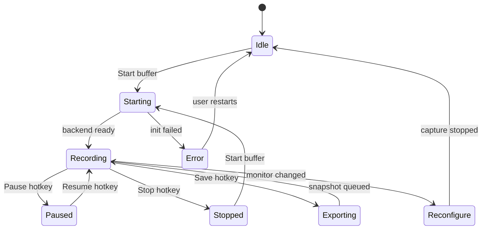
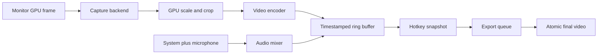

# LastFrame техническое задание

Версия документа: 1.0  
Статус: baseline для разработки  
Язык продукта: русский и английский  
Целевая аудитория: игроки и пользователи, которым нужно сохранить последние секунды экрана  
Репозиторий: `glebKovshov/LastFrame`

## 1. Назначение

LastFrame — бесплатная open-source утилита для Windows, Linux и macOS arm64. Она в фоне захватывает один выбранный монитор в кольцевой буфер и по глобальному хоткею сохраняет последние `N` секунд в видеофайл. Приложение работает локально, не требует аккаунта и не загружает клипы в облако.

Главный критерий продукта — получить короткий клип с минимальным влиянием на игру и с понятным современным окном настроек в стиле редакционного минимализма OpenAI/Anthropic.

Документ является нормативным: требования с идентификаторами `FR-*`, `NFR-*` и `AC-*` обязательны для версии 1.0, если в тексте явно не указано `Future`.

## 2. Решения по неоднозначным ответам

| Область | Решение для версии 1.0 | Причина |
|---|---|---|
| Длина буфера | По умолчанию 30 с; допустимо 5–300 с, шаг 1 с | Покрывает короткие игровые события и не создаёт неограниченный расход памяти |
| Начало работы | Приложение запускается вручную; после запуска буфер выключен, пользователь включает его из окна или трея | Соответствует ответу «запуск вручную» и не захватывает экран неожиданно |
| FPS | Постоянное значение, по умолчанию 60; минимум 15; максимум — текущая частота выбранного монитора | Значение не меняется автоматически после старта записи |
| Сохранение | Сначала быстро фиксируется снимок диапазона буфера, затем экспорт выполняется в отдельной очереди | Хоткей не блокирует захват и допускает несколько клипов подряд |
| Буфер | Гибрид: закодированные GOP-сегменты в RAM, временный spillover на локальный диск при превышении лимита RAM | Снижает запись на SSD, но не делает большие буферы невозможными |
| Звук | По умолчанию системный звук и микрофон сводятся в одну AAC-дорожку; микрофон можно отключить и выбрать устройство | Максимальная совместимость MP4 и простая настройка |
| Сохранение отдельных дорожек | Не входит в базовую UI-версию; внутренний API допускает добавление отдельной дорожки позже | Не усложнять MVP без явной пользовательской потребности |
| Формат | MP4 по умолчанию; MKV и WebM доступны в выпадающем списке | MP4 удобен для игр и обмена, MKV устойчивее при сбое |
| Кодек | Автовыбор аппаратного H.264; затем аппаратный HEVC/AV1 по возможностям и профилю; программный fallback | Интегрированная графика должна поддерживаться, но нельзя обещать аппаратный кодек на любом старом ПК |
| Пресеты | Low / Medium / High / Ultra и Custom | Пресеты дают простой выбор, Custom — точный контроль битрейта |
| Ограничение размера | По умолчанию 512 MiB на файл; пользователь задаёт 64 MiB–4 GiB | Предотвращает случайные гигабайтные файлы |
| Перегрузка | Перегрузка — устойчивый рост очереди кадров, drop rate, задержки энкодера, нехватка RAM/GPU или диска. Приоритет — FPS игры; предупреждение показывается, запись останавливается при невозможности безопасно продолжать | Сохранение старых клипов не должно удаляться автоматически |
| Обновления | Захват полностью offline. Проверка обновлений — отдельная ручная команда, отключённая по умолчанию; телеметрии нет | Согласует требования «полностью оффлайн» и «проверять обновления» |
| Лицензия | Предлагается GPL-3.0-or-later для самого проекта; список third-party лицензий обязателен | GPL-зависимости разрешены ответом пользователя, а проект остаётся open-source |

Если заказчик изменит любое решение, оно должно быть отражено в этом файле и в `CHANGELOG.md` до реализации.

## 3. Границы проекта

### 3.1 Входит в версию 1.0

- Захват только одного монитора.
- Режимы источника: вся рабочая область выбранного монитора или прямоугольная область.
- Масштабирование к пользовательскому выходному разрешению.
- Частота 15–частота монитора, постоянный FPS.
- Захват системного звука, опциональный микрофон, выбор конкретного устройства.
- Аппаратное кодирование с fallback.
- Кольцевой буфер последних `N` секунд.
- Очередь клипов, ограничение 3 сохранения в секунду и cooldown 5 секунд при превышении.
- Глобальные хоткеи, системный трей, уведомления, GTA-подобный индикатор записи на диск.
- Отслеживание изменения мониторов и разрешения.
- Полноценное окно настроек.
- JSON-настройки, переносимые между компьютерами.
- Русская и английская локализация.
- Автопроверки, диагностика, логирование без содержимого экрана.

### 3.2 Не входит

- Стриминг, вебкамера, монтаж, обрезка, эффекты, текст поверх видео.
- Облачная синхронизация, аккаунты, шаринг ссылкой.
- Галерея клипов внутри приложения.
- Одновременный захват нескольких мониторов.
- Перехват защищённого DRM-контента.
- Автоматическое удаление старых пользовательских клипов.
- RDP, виртуальные машины и облачные игровые сервисы как гарантированный сценарий.

## 4. Пользовательские сценарии

### 4.1 Первый запуск

1. Пользователь вручную запускает LastFrame.
2. Приложение проверяет единственный уже запущенный экземпляр.
3. Открывается окно начальной настройки с рекомендацией «Авто».
4. «Авто» выбирает монитор, безопасное разрешение, FPS, аппаратный энкодер и битрейт по короткому benchmark.
5. Пользователь даёт разрешения захвата экрана и микрофона, если ОС их запрашивает.
6. После сохранения настроек приложение сворачивается в трей; буфер можно включить кнопкой «Начать буфер».

### 4.2 Сохранение клипа

1. Буфер активен и содержит последние доступные кадры и аудио.
2. Пользователь нажимает `Ctrl+Shift+F10` или выбранный им хоткей.
3. Система за атомарную операцию добавляет snapshot диапазона в очередь и немедленно продолжает захват.
4. На экране появляется маленький угловой overlay с анимированным индикатором записи на диск.
5. Экспортёр создаёт временный файл, финализирует контейнер, проверяет размер и переименовывает его атомарно.
6. Показывается уведомление. Нажатие уведомления открывает папку и по возможности выделяет файл.

### 4.3 Пауза, остановка и очистка

- `Ctrl+Shift+F7` ставит захват на паузу, сохраняя текущий буфер. Повторное нажатие продолжает захват.
- `Ctrl+Shift+F5` останавливает поступление новых кадров в буфер. Уже накопленный буфер остаётся доступен для сохранения до очистки или перезапуска захвата.
- `Ctrl+Shift+F1` очищает буфер без удаления ранее сохранённых клипов.
- Остановка, пауза и очистка отображаются в трее и в окне настроек.

## 5. Функциональные требования

### 5.1 Захват экрана

- **FR-CAP-001**: приложение должно захватывать ровно один выбранный монитор.
- **FR-CAP-002**: список мониторов должен показывать стабильный идентификатор, имя, разрешение, ориентацию и текущую частоту.
- **FR-CAP-003**: источник должен переключаться между `Full monitor` и `Custom region`.
- **FR-CAP-004**: выбор области выполняется полноэкранным затеняющим overlay выбранного монитора: фон затемнён, выделенная область светлая, координаты и размеры отображаются рядом с курсором.
- **FR-CAP-005**: область должна ограничиваться границами выбранного монитора и сохраняться в логических координатах с учётом DPI.
- **FR-CAP-006**: курсор захватывается по умолчанию; отдельный переключатель `Show cursor` отключает его. Клики мыши не визуализируются.
- **FR-CAP-007**: DRM/защищённый контент отображается как чёрный кадр, не обходится и не сохраняется каким-либо отдельным способом.
- **FR-CAP-008**: HDR в первой версии преобразуется в SDR с явным предупреждением о возможной потере HDR-диапазона. Сохранение настоящего HDR — Future.
- **FR-CAP-009**: при недоступности API захвата пользователь видит собственное окно ошибки с причиной и рекомендацией действия.

### 5.2 Разрешение и FPS

- **FR-VID-001**: выходное разрешение выбирается независимо от разрешения монитора и поддерживает `Native`, готовые варианты и Custom.
- **FR-VID-002**: масштабирование выполняется на GPU, если доступно, иначе в выделенном worker.
- **FR-VID-003**: FPS является постоянным для одной сессии. Нижняя граница — 15 FPS, верхняя — частота выбранного монитора на момент включения буфера.
- **FR-VID-004**: после изменения частоты монитора активная сессия прекращается безопасно и требует повторного запуска; значение FPS не подстраивается молча.
- **FR-VID-005**: если целевое разрешение/FPS/битрейт не гарантируются профилем устройства, UI должен показать предупреждение до включения буфера.

### 5.3 Аудио

- **FR-AUD-001**: системный звук включён по умолчанию.
- **FR-AUD-002**: пользователь может выбрать устройство системного звука или `Auto`.
- **FR-AUD-003**: микрофон включается отдельным переключателем; по умолчанию включён, если устройство доступно.
- **FR-AUD-004**: пользователь может выбрать конкретный микрофон и изменить громкость system/mic отдельно.
- **FR-AUD-005**: хоткей mute/unmute микрофона доступен из настроек и меню трея.
- **FR-AUD-006**: системный звук и микрофон микшируются в одну дорожку с временными метками общего master clock. При отсутствии источника соответствующая часть микса заполняется тишиной.
- **FR-AUD-007**: отключение или переподключение устройства не должно ронять процесс; приложение показывает предупреждение и продолжает без недоступного источника.
- **FR-AUD-008**: sample rate по умолчанию 48 kHz, stereo, AAC для MP4; для MKV/WebM допускается Opus.

### 5.4 Кодирование и форматы

- **FR-ENC-001**: профиль `Auto` выбирает аппаратный H.264 с совместимым уровнем и только затем другие кодеки.
- **FR-ENC-002**: аппаратные backend’ы должны включать доступные NVIDIA NVENC, AMD AMF/VCN, Intel Quick Sync/VAAPI, Apple VideoToolbox. Конкретный backend выбирается capability probe.
- **FR-ENC-003**: программный fallback разрешён, но при достижении порога CPU должен показать предупреждение и остановить буфер, если безопасное продолжение невозможно.
- **FR-ENC-004**: контейнеры в UI: MP4, MKV, WebM. Невалидные пары codec/container блокируются.
- **FR-ENC-005**: пресеты: Low, Medium, High, Ultra. В Custom ползунок битрейта активен; при выборе пресета ползунок readonly и визуально показывает рассчитанное значение.
- **FR-ENC-006**: выходной файл ограничивается пользователем в диапазоне 64 MiB–4 GiB, значение по умолчанию 512 MiB.
- **FR-ENC-007**: при достижении лимита экспортёр прекращает запись текущего клипа корректно, уведомляет пользователя и не удаляет старые клипы.
- **FR-ENC-008**: MP4 пишется через временный файл и атомарный rename после успешной финализации; недописанный временный файл удаляется при следующем запуске.

### 5.5 Кольцевой буфер и экспорт

- **FR-BUF-001**: буфер хранит только последние `N` секунд по media timestamps, а не по количеству кадров.
- **FR-BUF-002**: видео хранится как GOP-сегменты с независимыми ключевыми кадрами, аудио — синхронные packet chunks.
- **FR-BUF-003**: новый сегмент начинается не реже чем раз в 1 секунду и всегда содержит keyframe в начале.
- **FR-BUF-004**: RAM ring buffer имеет настраиваемый лимит и мягкий порог 70%; после превышения новые завершённые сегменты перемещаются в защищённый временный каталог на выбранном системном диске.
- **FR-BUF-005**: временные сегменты удаляются после успешного экспорта, очистки буфера, остановки приложения или восстановления после crash.
- **FR-BUF-006**: экспорт начинается с ближайшего keyframe до `now-N`, но итоговая длительность должна быть в пределах `N ± 1/FPS + 200 ms`, если доступен полный буфер.
- **FR-BUF-007**: сохранение не останавливает writer capture. Snapshot только увеличивает reference count сегментов до окончания экспорта.
- **FR-BUF-008**: одновременные snapshot’ы допускаются; одинаковые имена получают суффиксы `(1)`, `(2)` и далее.
- **FR-BUF-009**: имя файла: `LastFrame_YYYY-MM-DD_HH-mm-ss.ext`; локаль не влияет на сортируемый формат.
- **FR-BUF-010**: при старте приложения незавершённые временные клипы удаляются, но пользовательские завершённые клипы не трогаются.

### 5.6 Ограничение частоты сохранений

- **FR-RATE-001**: не более трёх запросов сохранения за любую скользящую секунду.
- **FR-RATE-002**: при четвёртом запросе показывается компактное предупреждение в углу и включается блокировка новых snapshot’ов на 5 секунд.
- **FR-RATE-003**: запросы, принятые до блокировки, сохраняются в FIFO-очереди. Размер очереди по умолчанию 8, максимум 32; при переполнении новый запрос отклоняется с предупреждением.
- **FR-RATE-004**: очередь ограничивается общим дисковым лимитом и не должна вытеснять уже завершённые клипы.

### 5.7 Состояние мониторов и восстановление

- **FR-MON-001**: отдельный мониторинг-поток проверяет добавление/удаление монитора, изменение разрешения, ориентации, DPI и частоты не реже 1 раза в 500 ms.
- **FR-MON-002**: при изменении выбранного монитора или его режима захват немедленно останавливается, текущий snapshot корректно финализируется, новые кадры в буфер не поступают.
- **FR-MON-003**: в правом углу показывается уведомление «Запись остановлена: изменилась конфигурация монитора».
- **FR-MON-004**: после восстановления того же монитора и совместимой конфигурации приложение автоматически продолжает захват после debounce 2 секунды; переключатель `Auto resume` доступен пользователю и включён по умолчанию. Если разрешение, частота или формат несовместимы, буфер остаётся остановленным до ручного действия.
- **FR-MON-005**: при временном сбое драйвера выполняется до трёх попыток восстановления с backoff 250/500/1000 ms. После этого требуется ручной перезапуск захвата.

- **FR-LIFE-001**: при блокировке, sleep или hibernate захват приостанавливается, освобождает platform session и возобновляется после разблокировки, если ОС вернула тот же источник и `Auto resume` включён.
- **FR-LIFE-002**: при безопасном возобновлении после sleep/lock старый буфер сохраняется только если media clock непрерывен; иначе он очищается с уведомлением, чтобы не выдавать клип с неверными временными метками.

### 5.8 Настройки, переносимость и единственный экземпляр

- **FR-SET-001**: настройки хранятся в читаемом JSON UTF-8.
- **FR-SET-002**: отсутствующий или повреждённый файл заменяется дефолтным, исходный повреждённый файл переименовывается в `.broken-<timestamp>`.
- **FR-SET-003**: неизвестные поля сохраняются при записи для forward compatibility.
- **FR-SET-004**: `settings.json` не содержит абсолютных путей к устройствам; идентификаторы устройств — подсказки с fallback на `Auto`.
- **FR-SET-005**: приложение — single instance. Повторный запуск активирует существующее окно/трей и передаёт ему аргументы.
- **FR-SET-006**: каталог клипов по умолчанию создаётся автоматически в пользовательском каталоге Videos/LastFrame. Пользователь может выбрать только локальный системный накопитель; сетевые и съёмные пути отмечаются предупреждением и не являются гарантированными.

## 6. Горячие клавиши и трей

| Действие | По умолчанию | Изменяемо |
|---|---|---|
| Сохранить последние N секунд | `Ctrl+Shift+F10` | Да |
| Очистить буфер | `Ctrl+Shift+F1` | Да |
| Пауза/продолжение | `Ctrl+Shift+F7` | Да |
| Остановить/продолжить поступление кадров | `Ctrl+Shift+F5` | Да |
| Mute/unmute микрофона | Не назначен | Да |

Требования к хоткеям:

- регистрируются глобально и работают поверх игр;
- при конфликте показывается собственное предупреждение и комбинация не активируется;
- комбинация должна быть проверена до сохранения настроек;
- на macOS отображается `⌘` в UI, но внутренний конфиг хранит абстрактные модификаторы;
- если ОС не позволяет глобальный хоткей, в окне ошибки предлагается открыть разрешения Accessibility/Input Monitoring.

Контекстное меню трея:

1. Сохранить клип.
2. Начать/остановить буфер.
3. Пауза/продолжение.
4. Очистить буфер.
5. Mute/unmute микрофона.
6. Открыть папку клипов.
7. Настройки.
8. Выход.

Цвет иконки — единственная постоянная индикация в трее: серый выключено, зелёный активно, жёлтый пауза/предупреждение, красный ошибка.

## 7. Интерфейс

### 7.1 Визуальная система

- Светлая и тёмная тема, по умолчанию системная.
- Нейтральный фон, чёрный текст, один акцентный цвет, радиус 10–12 px, без декоративных градиентов.
- Иерархия: короткие заголовки, просторные секции, понятные inline-подсказки.
- Все состояния доступны с клавиатуры; minimum target size 32×32 px.
- Ошибки и предупреждения не используют только цвет: есть иконка и текст.

### 7.2 Экраны

1. **Overview** — состояние буфера, монитор, область, FPS, длительность, кнопки Start/Pause/Save.
2. **Capture** — монитор, Full monitor/Custom region, cursor, output resolution, FPS.
3. **Video** — codec Auto/manual, format, preset, bitrate, max file size, estimated size.
4. **Audio** — system device, microphone device, volume sliders, mute hotkey.
5. **Hotkeys** — таблица действий, запись комбинации, конфликт.
6. **Storage** — каталог, свободное место, временный каталог, очистка временных файлов.
7. **Notifications** — toast/overlay toggles, notification language. Звуковая обратная связь не реализуется.
8. **Advanced** — RAM limit, hybrid buffer, logs, update check, diagnostics.
9. **About** — версия, лицензия, ссылки на исходники и third-party notices.

### 7.3 Угловой overlay

Overlay не является игровым HUD и не показывает постоянно статус. Он используется только для:

- анимации записи клипа на диск (кольцевая GTA-подобная дуга + процент при известном прогрессе);
- ограничения частоты хоткея;
- изменения монитора;
- ошибок, требующих действия.

Положение, длительность, прозрачность и отключение уведомлений настраиваются. Overlay должен быть click-through и не попадать в захват; перед экспортом он также исключается из compositing, если это поддерживает backend.

## 8. Архитектура

### 8.1 Модули

```text
App
├── Core
│   ├── AppLifecycle
│   ├── StateMachine
│   ├── Clock
│   └── SingleInstance
├── Capture
│   ├── ICaptureBackend
│   ├── WindowsDxgiCapture
│   ├── WindowsGraphicsCaptureFallback
│   ├── MacScreenCaptureKit
│   ├── LinuxPipeWirePortal
│   └── LinuxX11Capture
├── Audio
│   ├── IAudioBackend
│   ├── WasapiLoopback
│   ├── CoreAudio
│   ├── PipeWireAudio
│   └── AudioMixer
├── Media
│   ├── GpuScaler
│   ├── EncoderFactory
│   ├── VideoEncoder
│   ├── AudioEncoder
│   ├── SegmentMuxer
│   ├── RingBuffer
│   └── ClipExporter
├── Platform
│   ├── MonitorEnumerator
│   ├── GlobalHotkeyManager
│   ├── Tray
│   ├── Notifications
│   ├── PermissionManager
│   └── FileReveal
├── Settings
│   ├── SettingsModel
│   ├── JsonStore
│   ├── Migration
│   └── Validation
└── UI
    ├── MainWindow
    ├── RegionSelector
    ├── SettingsPages
    └── Overlay
```

Публичные интерфейсы модулей должны быть узкими и не передавать Qt UI-объекты в capture/media worker’ы. Потоки общаются через typed messages, lock-free/SPSC очереди там, где это оправдано, и явные ownership rules.

### 8.2 Потоки

| Поток | Назначение | Ограничения |
|---|---|---|
| UI | Qt окна и события | Не выполняет capture, encode и файловый I/O |
| Capture | Получение GPU frames | Не ждёт UI и exporter |
| Audio | Capture и timestamping | Не блокируется на диске |
| Media | scale, encode, segment mux | Backpressure через bounded queue |
| Export | snapshot, mux, atomic rename | Параллельность ограничена числом CPU/GPU jobs |
| Monitor | состояние дисплеев и устройств | Интервал 500 ms, debounce 250 ms |
| Diagnostics | метрики и логирование | Никогда не пишет pixels или audio |

### 8.3 Жизненный цикл



### 8.4 Основной поток данных



## 9. Детали ring buffer

Сегмент — неизменяемый набор encoded packets с границами времени `[startPts, endPts)`, keyframe в начале, video stream, optional audio stream и checksum метаданных. Ring index хранит только lightweight descriptors; сами байты принадлежат RAM arena или временному segment file.

Алгоритм сохранения:

1. Считать `cutoff = masterNow - bufferDuration`.
2. Выбрать первый сегмент с `startPts <= cutoff` и ближайший keyframe к cutoff.
3. Добавить все video/audio packets до `masterNow`.
4. Пересчитать timestamps от нуля, восстановить priming/duration аудио.
5. Передать immutable snapshot экспортёру и увеличить reference count сегментов.
6. После успешного mux уменьшить reference count; сегмент удаляется только если он больше не нужен ring или export.

При паузе новые timestamps не появляются. Старые данные сохраняются, но после возобновления естественно стареют относительно wall clock; UI указывает фактическую доступную длительность.

## 10. Платформенные реализации

| Платформа | Захват экрана | Аудио | Глобальные хоткеи | Упаковка |
|---|---|---|---|---|
| Windows 10/11 x64 | DXGI Desktop Duplication для монитора; Windows.Graphics.Capture fallback | WASAPI loopback + microphone | RegisterHotKey/Raw Input fallback | MSIX или MSI/EXE |
| Linux x64 X11 | XCB/Damage или PipeWire backend | PipeWire/PulseAudio | X11/XInput; compositor-specific fallback | AppImage + deb |
| Linux x64 Wayland | xdg-desktop-portal ScreenCast + PipeWire | PipeWire | compositor/portal limitations shown in UI | Flatpak + AppImage |
| macOS 13+ arm64 | ScreenCaptureKit | ScreenCaptureKit/CoreAudio | Carbon/Quartz Event Services with Accessibility permission | DMG/pkg |

Windows Graphics Capture и ScreenCaptureKit — системные высокопроизводительные API; Linux Wayland использует ScreenCast portal и PipeWire. Поддержка exclusive fullscreen, HDR и отдельных античит-режимов зависит от ОС/драйвера и должна показываться как capability, а не обещаться без проверки.

Ссылки на первичные API: [Windows screen capture](https://learn.microsoft.com/en-us/windows/apps/develop/media-authoring-processing/screen-capture), [Apple ScreenCaptureKit](https://developer.apple.com/documentation/screencapturekit), [XDG ScreenCast](https://flatpak.github.io/xdg-desktop-portal/docs/doc-org.freedesktop.portal.ScreenCast.html).

## 11. Стек

- C++23, CMake 3.28+, Qt 6.8 LTS or newer supported Qt 6 release, Qt Widgets + Qt Core/Gui/Concurrent.
- FFmpeg libraries (`libavcodec`, `libavformat`, `libavutil`, `libswscale`, `libswresample`) with hardware backends enabled per platform.
- `spdlog` для файловых логов, `nlohmann/json` для settings, Catch2 или GoogleTest для unit tests, clang-format/clang-tidy.
- Native SDKs: Windows SDK/DirectX, Apple ScreenCaptureKit/CoreMedia/VideoToolbox, PipeWire/Portal/XCB/ALSA or PulseAudio as detected.
- CI: GitHub Actions, matrix Windows/Linux/macOS arm64; build, unit tests, clang-tidy, package smoke tests.
- Все зависимости фиксируются lock/manifest-файлами и перечисляются в `THIRD_PARTY_NOTICES.md`.

FFmpeg допускается в LGPL/GPL конфигурации; итоговая лицензия и обязательства должны быть проверены для каждой собираемой комбинации. См. [официальные лицензионные разъяснения FFmpeg](https://ffmpeg.org/legal.html). Нельзя подключать non-free или сетевые компоненты в release-профиль.

## 12. JSON-конфигурация

Пример минимально полного файла:

```json
{
  "schemaVersion": 1,
  "language": "ru",
  "buffer": {
    "durationSeconds": 30,
    "ramLimitMiB": 512,
    "temporaryDirectory": "",
    "autoStart": false
  },
  "capture": {
    "monitorId": "auto",
    "source": "full_monitor",
    "region": { "x": 0, "y": 0, "width": 0, "height": 0 },
    "outputWidth": 0,
    "outputHeight": 0,
    "fps": 60,
    "showCursor": true
  },
  "video": {
    "container": "mp4",
    "codec": "auto",
    "preset": "high",
    "customBitrateKbps": 12000,
    "maxFileSizeMiB": 512
  },
  "audio": {
    "systemEnabled": true,
    "systemDeviceId": "auto",
    "microphoneEnabled": true,
    "microphoneDeviceId": "auto",
    "systemVolume": 1.0,
    "microphoneVolume": 1.0,
    "sampleRate": 48000
  },
  "hotkeys": {
    "save": "Ctrl+Shift+F10",
    "clear": "Ctrl+Shift+F1",
    "pause": "Ctrl+Shift+F7",
    "toggleCapture": "Ctrl+Shift+F5",
    "muteMicrophone": ""
  },
  "storage": {
    "clipsDirectory": "",
    "maxQueueLength": 8
  },
  "notifications": {
    "enabled": true,
    "overlayEnabled": true,
    "language": "ru",
    "corner": "top_right",
    "durationMs": 3500,
    "opacity": 0.9
  },
  "privacy": {
    "updateCheckEnabled": false,
    "telemetryEnabled": false
  }
}
```

Миграции схемы — последовательные функции `vN -> vN+1`; запись выполняется через `settings.json.tmp`, fsync и atomic rename.

## 13. Производительность и надёжность

Нефункциональные требования:

- **NFR-PERF-001**: UI thread не выполняет захват, кодирование, muxing или блокирующий файловый I/O.
- **NFR-PERF-002**: все межпоточные очереди имеют конечную ёмкость и измеряемую backpressure-метрику.
- **NFR-PERF-003**: дополнительные фоновые потоки не создаются для каждого кадра или каждого клипа.
- **NFR-REL-001**: завершение приложения останавливает capture, дожидается worker’ов и освобождает native/GPU/audio ресурсы без утечек.
- **NFR-REL-002**: операции записи файлов используют временное имя и atomic rename; частично записанный клип не выдаётся пользователю как готовый.
- **NFR-REL-003**: crash recovery не восстанавливает и не удаляет пользовательские завершённые клипы.
- **NFR-SEC-001**: локальные логи и диагностика не содержат pixels, audio samples, microphone data или содержимое окон.
- **NFR-SEC-002**: приложение не обходит системные разрешения захвата и не устанавливает драйверы без явного отдельного решения.
- **NFR-MAINT-001**: платформенные backends скрыты за интерфейсами и не протекают в UI-модели.
- **NFR-MAINT-002**: публичные настройки имеют schema version и миграции; неизвестные поля не теряются.
- **NFR-UX-001**: все пользовательские ошибки объясняются на русском и английском и имеют действие восстановления либо понятную причину невозможности.
- **NFR-COMPAT-001**: сборка не должна требовать интернет-доступа во время работы capture и export.

### 13.1 Целевые показатели

- При 1080p60 на рекомендованном железе дополнительная загрузка CPU не более 5% в среднем, RAM процесса без spillover не более 512 MiB сверх настроенного буфера, capture-to-ring latency p95 не более 100 ms.
- Потеря кадров захвата — менее 1% в стабильной сессии на рекомендованном железе.
- Нажатие хоткея не должно блокировать UI более 16 ms.
- Первичная реакция overlay — не позднее 100 ms после принятого хоткея.
- Финализированный файл появляется не позднее 5 секунд после хоткея для 30-секундного 1080p60 клипа на рекомендованном SSD; это target, а не гарантия для тяжёлых конфигураций.
- При нехватке ресурсов приоритеты: 1) не фризить игру/UI, 2) не повреждать уже сохранённые файлы, 3) сохранить максимально возможное качество.

### 13.2 Ресурсные предохранители

- bounded queues на capture/media/export;
- watchdog задержки энкодера и диска;
- мягкий и жёсткий лимиты RAM/диска;
- безопасное освобождение GPU textures, AVFrames, AVPackets, file handles и audio clients в RAII;
- все worker’ы останавливаются через cancellation token и join до уничтожения backend’а;
- crash handler пишет только stack/состояние, не дампит экран или аудио.

### 13.3 Ошибки

Собственное окно ошибки должно содержать: краткое описание, технический код, безопасное действие, кнопку `Скопировать диагностику`, ссылку на лог и кнопку `Перезапустить захват`. Ошибки `disk_full`, `encoder_unavailable`, `permission_denied`, `audio_device_lost`, `monitor_changed`, `hotkey_conflict`, `queue_overflow` должны различаться.

## 14. Приватность и offline

- Кадры, звук и микрофон никогда не покидают компьютер.
- Телеметрия и crash upload отключены и не реализуются в версии 1.0.
- Логи не содержат пикселей, текста окон, содержимого аудио, имён файлов вне выбранного пути и секретов.
- Пользователь явно включает захват и может поставить паузу.
- Приложение не пытается обходить DRM, permission prompts или security boundaries ОС.
- Проверка обновлений, если включена вручную, отправляет только версию приложения и платформу на заранее зафиксированный URL; функция легко отключается и не связана с capture.

## 15. Тестирование

### 15.1 Обязательные автоматические тесты

- RingBuffer: eviction по PTS, пауза, snapshot, перекрывающиеся export jobs, refcount.
- FilenameAllocator: timestamp, collisions `(1)`, `(2)`, Unicode пути.
- RateLimiter: 3 события/секунду, cooldown 5 секунд, FIFO queue.
- Settings: defaults, malformed JSON, unknown fields, migrations, atomic write.
- Hotkey parser/conflicts и state machine.
- AudioMixer: silence fill, clipping, volume, mute transitions.
- Encoder capability selection и invalid container/codec pairs.

### 15.2 Интеграционные и ручные проверки

- Windows 10/11 с NVIDIA, AMD, Intel iGPU; Linux X11/Wayland; macOS arm64.
- 1080p60 минимум, 1440p/4K и high refresh в capability/benchmark режиме.
- DX11/DX12/Vulkan/OpenGL игры, borderless и exclusive fullscreen best effort.
- Подключение/отключение монитора, изменение разрешения/частоты/DPI.
- Sleep/hibernate/lock/unlock, перезапуск драйвера, исчезновение аудиоустройства.
- Заполнение диска, отсутствие прав каталога, удаление временной папки, crash во время export.
- Повторные хоткеи, конфликт хоткея, несколько клипов в очереди.
- Проверка, что overlay не попадает в клип.

### 15.3 Критерии приёмки

- **AC-001** Given активный буфер 30 секунд, when пользователь нажимает Save, then итоговый файл содержит последние доступные 30 секунд с видео и выбранным звуком.
- **AC-002** Given три быстрых сохранения, when все экспортёры завершены, then созданы три файла с уникальными именами и корректными timestamps.
- **AC-003** Given четвёртое сохранение в скользящую секунду, when оно принято, then показано предупреждение и новые запросы блокируются на 5 секунд.
- **AC-004** Given изменение разрешения выбранного монитора, when monitor watcher обнаруживает событие, then новые кадры не поступают в буфер и пользователь получает уведомление.
- **AC-005** Given повреждённый settings.json, when приложение запускается, then создаётся рабочая конфигурация по умолчанию, а исходный файл сохраняется как backup.
- **AC-006** Given недоступен аппаратный encoder, when пользователь нажимает Start, then выбирается разрешённый fallback или показывается понятная ошибка с причиной.
- **AC-007** Given заполнен диск во время export, when write fails, then старые клипы не удаляются, временный файл очищается, а пользователь получает предупреждение.
- **AC-008** Given активен региональный capture, when пользователь выбирает область, then в клипе присутствуют только пиксели выбранного прямоугольника с корректным масштабом.
- **AC-009** Given приложение запущено второй раз, when второй процесс стартует, then новый процесс завершается, а существующее окно/трей активируется.
- **AC-010** Given включено уведомление о сохранённом файле, when пользователь нажимает его, then открывается каталог и файл выделяется, если это поддерживает платформа.

## 16. Структура репозитория

```text
LastFrame/
├── CMakeLists.txt
├── CMakePresets.json
├── LICENSE
├── README.md
├── CONTRIBUTING.md
├── CHANGELOG.md
├── THIRD_PARTY_NOTICES.md
├── docs/
│   ├── TECHNICAL_SPECIFICATION_RU.md
│   ├── ARCHITECTURE.md
│   ├── USER_GUIDE_RU.md
│   └── USER_GUIDE_EN.md
├── src/
│   ├── app/
│   ├── core/
│   ├── capture/
│   ├── audio/
│   ├── media/
│   ├── platform/
│   ├── settings/
│   └── ui/
├── tests/
├── packaging/
└── .github/workflows/
```

Стиль C++ — `CamelCase` для классов/методов и согласованный lowerCamelCase для локальных переменных; правило должно быть формализовано в `.clang-format`. Каждый публичный класс получает unit test или явное обоснование отсутствия теста.

## 17. Definition of Done

Функция считается готовой, когда есть реализация, unit/integration test, локализованные строки RU/EN, обработка ошибки, запись в пользовательскую документацию, отсутствие утечек по sanitizer/RAII-проверкам и CI green на доступных runner’ах. Перед релизом обязательны smoke tests упаковок всех поддерживаемых платформ и ручная проверка 10 критериев `AC-*`.

## 18. Открытые вопросы перед первым production-релизом

1. Подтвердить точную минимальную версию Windows и macOS, которую нужно поддерживать.
2. Подтвердить юридическую лицензию проекта (в документе предложена GPL-3.0-or-later).
3. Утвердить release-политику подписи установщиков и URL ручной проверки обновлений.
4. Получить тестовые машины с NVIDIA, AMD, Intel iGPU и macOS arm64.
5. Зафиксировать benchmark-профили для Low/Medium/High/Ultra после измерений.

До ответа на эти вопросы разработчик использует решения из раздела 2 и не расширяет scope самостоятельно.
